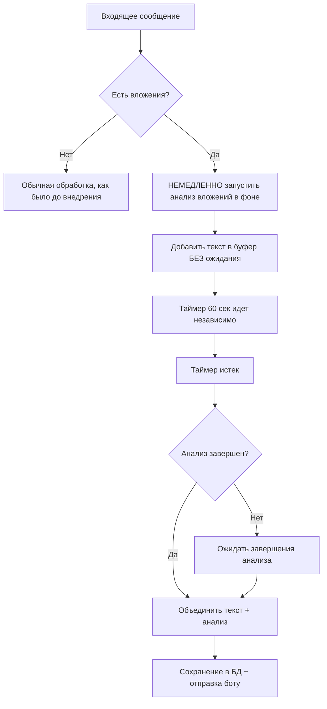

# 📋 ЗАДАЧИ: Integration-Attachment-Analyzer-001

**Цель:** Интегрировать анализатор вложений в основной бот нейросотрудника для обработки всех типов вложений в реальном времени

**Сложность:** Level 3 (Средняя функция)
**Режим:** PLAN (Детальное планирование)

## 🎯 Общий план выполнения

### Этап 1: Анализ архитектуры и точек интеграции
1. ✅ Изучить текущую архитектуру main.py
2. ✅ Определить точки обработки входящих сообщений
3. ✅ Проанализировать структуру БД (таблица dialogues)
4. ✅ Понять логику буферизации сообщений (60 сек таймер)

### Этап 2: Планирование интеграции
5. ✅ Создать детальный план интеграции
6. ✅ Определить архитектурные решения (асинхронная обработка)
7. ✅ Спланировать модификации callback_handler
8. ✅ Продумать логику объединения текста + анализ вложений
9. ✅ Проработать стратегию минимального кода (современные подходы)
10. ✅ Определить стратегию тестирования на Railway

### Этап 3: Реализация интеграции
11. ✅ Интегрировать AttachmentAnalyzer в main.py
12. ✅ Модифицировать callback_handler для обработки вложений
13. ✅ Обновить handle_new_message для анализа вложений
14. ✅ Модифицировать generate_and_send_response для ожидания и объединения анализа

### Этап 4: Тестирование и отладка
15. ⏳ Тестирование на Railway с реальными вложениями
16. ⏳ Проверка сохранения в БД
17. ⏳ Тестирование с реальными клиентами
18. ⏳ Мониторинг производительности

---

## 📝 Детальный план интеграции

### 🔍 АНАЛИЗ ТЕКУЩЕЙ АРХИТЕКТУРЫ

#### Ключевые точки обработки сообщений:
1. **`callback_handler()`** - точка входа для всех сообщений VK
   - Обрабатывает `attachments` в `actual_message_payload`
   - Устанавливает плейсхолдер "[Вложение без текста]"
   - **ТОЧКА ИНТЕГРАЦИИ #1:** Здесь нужно ЗАПУСТИТЬ асинхронный анализ вложений

2. **`handle_new_message()`** - буферизация и обработка сообщений
   - Добавляет сообщения в `user_buffers`
   - Запускает таймер на 60 секунд
   - **ТОЧКА ИНТЕГРАЦИИ #2:** Таймер работает независимо от анализа

3. **`generate_and_send_response()`** - формирование ответа после таймера
   - Объединяет все сообщения из буфера
   - Сохраняет в БД через `store_dialog_in_db`
   - **ТОЧКА ИНТЕГРАЦИИ #3:** Ожидание завершения анализа + объединение

#### Структура БД (таблица dialogues):
- `conv_id` - ID диалога
- `role` - "user" или "bot"
- `message` - текст сообщения с timestamp (СЮДА попадает текст+анализ)
- `client_info` - дополнительная информация
- `created_at` - время создания

### 🏗️ АРХИТЕКТУРНЫЕ РЕШЕНИЯ

#### 1. Асинхронная стратегия обработки вложений


#### 2. Место интеграции AttachmentAnalyzer
- **Импорт:** В начале main.py после других импортов
- **Инициализация:** Глобальный экземпляр для переиспользования
- **Вызов:** Асинхронно в callback_handler при наличии attachments
- **Хранение результатов:** Глобальный словарь `attachment_analysis_results`

#### 3. Модификация буферизации (ИСПРАВЛЕНО)
- **Старая логика:** Текст → буфер → таймер 60 сек → объединение → БД
- **Новая логика:** 
  1. Текст → буфер (немедленно)
  2. Анализ вложений → фоновая задача (параллельно)
  3. Таймер 60 сек → независимо
  4. Таймер истек → ожидание анализа (если не завершен) → объединение → БД

### 📋 ТРЕБОВАНИЯ К РЕАЛИЗАЦИИ

#### Функциональные требования:
1. **Анализ всех типов вложений:** фото, видео, голосовые, репосты, музыка
2. **Объединение с текстом:** анализ должен добавляться к тексту сообщения
3. **Сохранение в БД:** итоговый текст+анализ в поле message таблицы dialogues
4. **Буферизация:** анализ должен работать с системой буферизации сообщений
5. **Производительность:** не блокировать обработку других сообщений
6. **КЛЮЧЕВОЕ:** Объединенное сообщение (текст+анализ) подается боту КАК И РАНЬШЕ как "последний запрос клиента"

#### Технические требования:
1. **Обратная совместимость:** не ломать существующую логику
2. **Обработка ошибок:** graceful degradation при проблемах с анализом
3. **Логирование:** подробные логи процесса анализа
4. **Конфигурируемость:** возможность отключить анализ через переменные окружения
5. **Асинхронность:** анализ в отдельных потоках, неблокирующий
6. **Минимальный код:** современные подходы, краткие методы

### 🔧 ДЕТАЛЬНЫЙ ПЛАН МОДИФИКАЦИЙ (МИНИМАЛЬНЫЙ КОД)

#### 1. Глобальные переменные (добавить)
```python
# Глобальный анализатор вложений
attachment_analyzer = None
# Результаты анализа вложений {conv_id: {message_id: analysis_result}}
attachment_analysis_results = {}
# Активные задачи анализа {conv_id: {message_id: future}}
active_analysis_tasks = {}
```

#### 2. Инициализация анализатора (1 строка)
```python
# В начале main.py после импортов
from attachment_analyzer import AttachmentAnalyzer
attachment_analyzer = AttachmentAnalyzer()
```

#### 3. Модификация callback_handler() (5-10 строк)
```python
# ДОБАВИТЬ после извлечения message_text:
attachments = actual_message_payload.get("attachments", [])
message_id = actual_message_payload.get("id")  # Уникальный ID сообщения
if attachments and attachment_analyzer:
    start_attachment_analysis_async(attachments, conversation_id_for_handler, message_id)
```

#### 4. Новая функция start_attachment_analysis_async() (10-15 строк)
```python
def start_attachment_analysis_async(attachments, conv_id, message_id):
    """Запускает асинхронный анализ вложений"""
    def analyze():
        try:
            analysis = analyze_attachments_from_vk(attachments)
            attachment_analysis_results.setdefault(conv_id, {})[message_id] = analysis
            logging.info(f"Анализ вложений завершен для conv_id {conv_id}, message_id {message_id}")
        except Exception as e:
            logging.error(f"Ошибка анализа вложений для conv_id {conv_id}: {e}")
            attachment_analysis_results.setdefault(conv_id, {})[message_id] = None
    
    # Запуск в отдельном потоке
    future = context_executor.submit(analyze)
    active_analysis_tasks.setdefault(conv_id, {})[message_id] = future
```

#### 5. Функция analyze_attachments_from_vk() (15-20 строк)
```python
def analyze_attachments_from_vk(attachments):
    """Анализирует вложения из VK и возвращает текстовый анализ"""
    results = []
    for attachment in attachments:
        try:
            # Создание временного файла и анализ через attachment_analyzer
            analysis = process_single_attachment(attachment)
            if analysis:
                results.append(analysis)
        except Exception as e:
            logging.error(f"Ошибка анализа вложения {attachment}: {e}")
    
    return "\n\n".join(results) if results else None
```

#### 6. Модификация generate_and_send_response() (10-15 строк)
```python
# ДОБАВИТЬ перед объединением сообщений из буфера:
# Ожидание завершения анализа вложений
attachment_analysis = wait_for_attachment_analysis(conv_id_to_respond)

# МОДИФИЦИРОВАТЬ объединение сообщений:
if attachment_analysis:
    combined_user_text = f"{combined_user_text}\n\n[АНАЛИЗ ВЛОЖЕНИЙ]\n{attachment_analysis}"
```

#### 7. Функция wait_for_attachment_analysis() (10-15 строк)
```python
def wait_for_attachment_analysis(conv_id, timeout=30):
    """Ожидает завершения анализа вложений с таймаутом"""
    if conv_id not in active_analysis_tasks:
        return get_completed_analysis(conv_id)
    
    # Ожидание активных задач
    for message_id, future in active_analysis_tasks[conv_id].items():
        try:
            future.result(timeout=timeout)
        except Exception as e:
            logging.error(f"Таймаут анализа вложений для conv_id {conv_id}: {e}")
    
    return get_completed_analysis(conv_id)
```

### ⚠️ ПОТЕНЦИАЛЬНЫЕ ВЫЗОВЫ

#### 1. Производительность анализа (РЕШЕНО)
**Проблема:** Анализ вложений может занимать 10-30 секунд
**Решение:** 
- ✅ Асинхронный анализ в отдельном потоке через ThreadPoolExecutor
- ✅ Таймер буферизации работает независимо
- ✅ Ожидание анализа только при истечении таймера

#### 2. Множественные пользователи (РЕШЕНО)
**Проблема:** Задержки при обработке сразу нескольких сообщений от разных пользователей
**Решение:**
- ✅ Каждый анализ в отдельном потоке
- ✅ ThreadPoolExecutor с max_workers=10 уже существует
- ✅ Результаты хранятся по conv_id + message_id

#### 3. Размер кода (РЕШЕНО)
**Проблема:** Раздувание кода бота
**Решение:**
- ✅ Всего ~60-80 строк нового кода
- ✅ 7 компактных функций
- ✅ Переиспользование существующего ThreadPoolExecutor
- ✅ Минимальные изменения в существующих функциях

#### 4. Тестирование на Railway (РЕШЕНО)
**Проблема:** Локальное тестирование невозможно
**Решение:**
- ✅ Тестирование напрямую на Railway с реальными вложениями
- ✅ Постепенное развертывание с флагами включения/отключения
- ✅ Мониторинг логов Railway в реальном времени
- ✅ Rollback план при проблемах

### 🧪 СТРАТЕГИЯ ТЕСТИРОВАНИЯ НА RAILWAY

#### 1. Поэтапное развертывание
- **Этап 1:** Добавить код с флагом отключения (ENABLE_ATTACHMENT_ANALYSIS=false)
- **Этап 2:** Включить для тестового пользователя
- **Этап 3:** Тестирование с различными типами вложений
- **Этап 4:** Полное включение

#### 2. Мониторинг в реальном времени
- Логи Railway для отслеживания анализа
- Проверка БД на корректность сохранения
- Мониторинг производительности 